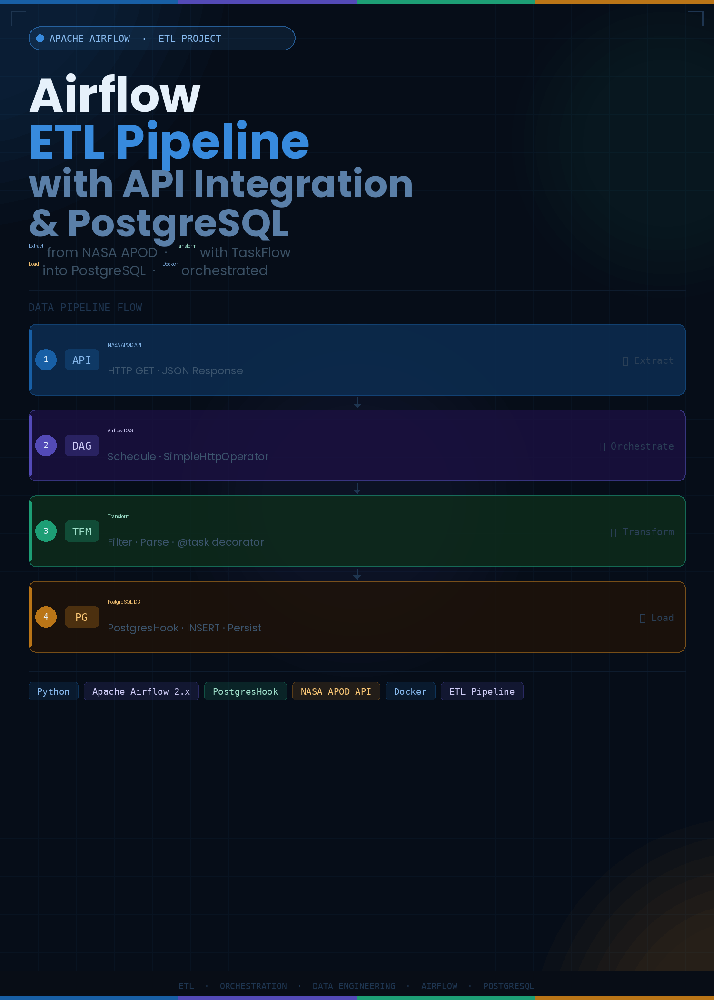

# 🚀 Airflow ETL Pipeline with API Integration & PostgreSQL

## 📌 Project Overview

This project demonstrates an end-to-end **ETL (Extract, Transform, Load) pipeline** built using Apache Airflow.

The pipeline extracts data from NASA’s Astronomy Picture of the Day (APOD) API, processes the response, and stores it in a PostgreSQL database.

The entire workflow is containerized using Docker, making it easy to run and reproduce.

---

## 🖼️ Architecture Overview



---

## 🛠️ Tech Stack

- Apache Airflow  
- Docker  
- PostgreSQL  
- Python  
- NASA APOD API  

---

## 🔄 How the Pipeline Works

### 1️⃣ Extract
- Data is fetched from NASA APOD API  
- Uses Airflow's HTTP-based operator  
- API returns JSON response  

---

### 2️⃣ Transform
- JSON data is cleaned and processed  
- Extract important fields:
  - title  
  - explanation  
  - URL  
  - date  
- Implemented using Airflow TaskFlow API (`@task`)  

---

### 3️⃣ Load
- Processed data is inserted into PostgreSQL  
- Uses `PostgresHook`  
- Table is created automatically if it doesn’t exist  

---

## ⚙️ Key Features

- Automated workflow using Airflow DAG  
- Task dependencies handled sequentially  
- Containerized setup using Docker  
- Real-world API integration  
- Handles common issues like:
  - Docker port conflicts  
  - Persistent volumes  
  - Database connection debugging  

---

## 🚀 How to Run

```bash
astro dev start
